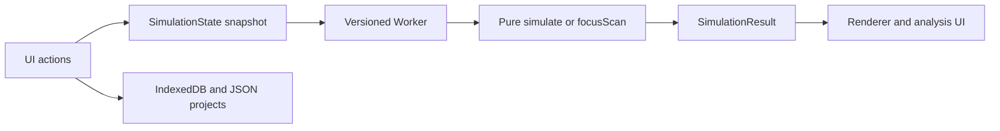

# Engineering workflow and system boundaries

The workflow follows [agentic-engineering-template](https://github.com/cct1123/agentic-engineering-template) under its [MIT license](records/TEMPLATE-LICENSE). [AGENTS.md](AGENTS.md) governs engineering; [PROJECT.md](PROJECT.md) records intent; [STATE.md](STATE.md) is the current checkpoint; [records](records/RECORDS.md) hold evidence/decisions; [human inputs](records/HUMAN_INPUTS.md) retain consequential steering; [REPORT](outputs/REPORT.md) states supported outcomes.

Tracy is software-only. The loop is inspect → choose consequential gap → implement → independently validate → record evidence → update state → repeat. No optical hardware is controlled. A future hardware project would retain AGENTS.md's explicit hardware review gate.

Implementation details, units and API: [docs/architecture.md](docs/architecture.md). Quantitative meaning: [docs/physics-definitions.md](docs/physics-definitions.md). Independent reference evidence: [docs/external-validation.md](docs/external-validation.md).
