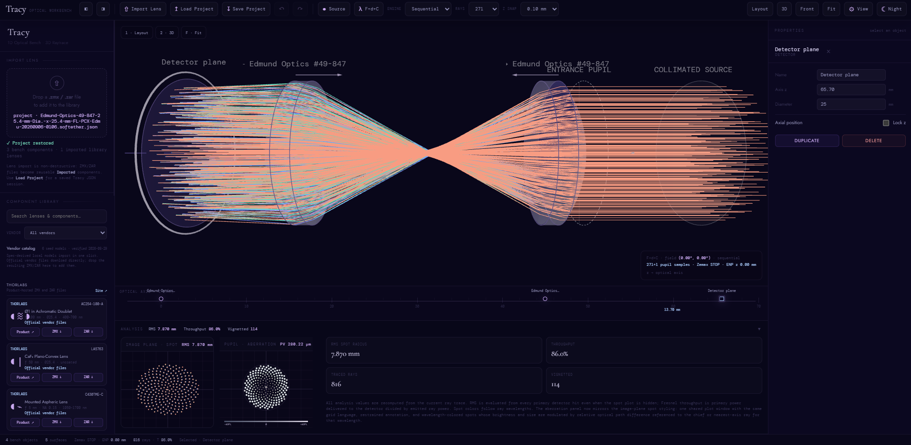

# Tracy optical workbench

Tracy lets you build a lens setup and see how light travels through it in your browser. Add lenses, move them along the bench, and see where the light lands on a detector.

No account is needed.



_Tracy in Night mode with a two-lens setup and detector controls._

## Get started

You need **Node.js 22.13 or newer** and a modern web browser.

1. Open a terminal in the Tracy project folder.
2. Install the dependencies and start the app:

   ```sh
   npm ci
   npm run dev
   ```

3. Leave the terminal running and open [Tracy in your browser](http://localhost:5173).

For later visits, just run `npm run dev` again. Use the browser address above rather than double-clicking `index.html`.

To try the setup pictured above, click **Load Project** and choose [examples/two-lens.tracy.json](examples/two-lens.tracy.json) from the project folder. It opens two lenses and a detector in Night mode. Loading it replaces the current setup.

## Try your first experiment

A lens and detector are already in place when you open Tracy.

1. Click **Layout** for a side view.
2. Scroll down in the left panel to **Bench objects** and select **Detector plane**.
3. In **Properties** on the right, change **Axis z** to move the detector, then press **Tab**.
4. Watch **RMS spot radius** in **Analysis**. It tells you how spread out the light spot is; a smaller number means a tighter spot.
5. Click **Undo** to return to the previous position.

To add a lens, drag a card from the **Component Library** onto the bench. Click a placed object to edit it.

The **[illustrated user guide](docs/user-guide.md)** shows each control with close-up screenshots. It also covers light settings, importing lenses, camera views, and common problems.

## Save your work

- **Save Project** downloads a file containing your setup. Keep it before closing or refreshing the page; your work is not saved automatically.
- **Load Project** opens a saved setup and replaces the current one.
- **Import Lens** adds a lens to the library. Drag its new card onto the bench to use it.

## More help

- [User guide](docs/user-guide.md): step-by-step help and troubleshooting.
- [Technical reference](docs/technical-reference.md): supported files, simulation limits, build commands, and code structure.
- [Third-party notices](THIRD_PARTY_NOTICES.md): licenses and credits.

## License

Tracy's original code and documentation use the [MIT License](LICENSE). See [Third-party notices](THIRD_PARTY_NOTICES.md) for dependency terms and the supplied Tracy prototype's licensing status.
