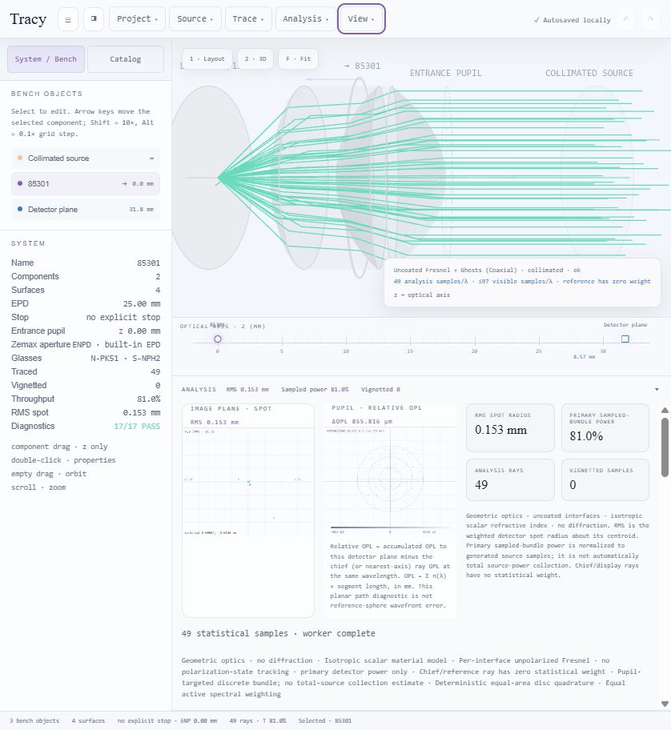
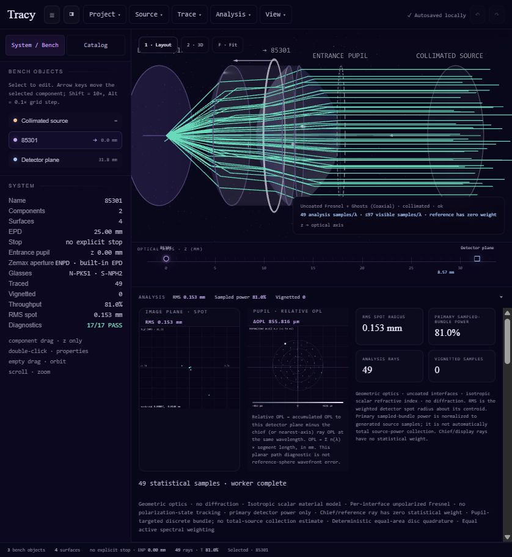

# Tracy optical workbench

Build coaxial lens systems, trace geometric rays, import optical prescriptions and inspect detector results in your browser. Calculations and project data stay on your device.

[Open hosted Tracy](https://tracy-optical-workbench.quantumsensing.chatgpt.site) — owner-private access; sign in with the Site owner's account. This published snapshot is at `7bfee883` and predates free placement, wavefront analysis and online catalog search. [Run the current source locally](#run-locally) to use those features. Pushing Git commits does not redeploy the Site.

Start with the **85301 doublet** already on the bench. The [illustrated user guide](docs/user-guide.md) walks through placement, source settings, analysis, focus, comparisons, imports and saving, with matching day/night screenshots.

**Day mode — the default doublet, bench and Analysis.**



**Night mode — the same controls and engineering workflow.**



These overview screenshots use the default doublet, d-line light, 49 analysis samples and the Fresnel engine. Ghost reflections are hidden for clarity; select a bench object to open Properties.

These overview screenshots document local revision `f5d3abd`. The guide's catalog and wavefront screenshots were refreshed from `a1ccb5e` in both themes; see [screenshot provenance](docs/images/tutorial/README.md).

## Try a first workflow

1. In **System / Bench**, select **Detector plane**. Its **Axis z** appears in Properties.
2. Open **Source → Wavelengths** to choose active wavelengths and their source weights. Open **Trace** to choose the engine and analysis sample count.
3. In Analysis, choose an active wavelength for **Wavefront error** and select **nm** or **waves**. Read RMS/PV and expand **Plot scales & phase conventions** for the detector-centered sphere, exit-pupil position and sign. Keep the same wavelength and tilt setting when comparing results.
4. Open **Analysis → A/B system comparison** and **Capture A** before moving the detector. Then choose **Analysis → Focus Scan** and try **From z = 30 mm**, **To z = 45 mm**, **Steps = 7**. This minimizes sampled spot RMS, not wavefront RMS. Read the curve and survival values before moving anything.
5. If you move the detector to a tested position, wait for the result and **Capture B**. Use **Shared A/B Scale** for plots and **Restore A** to return to the baseline.
6. Open **Project**, name the project **Tutorial doublet**, and choose **Save named project**. **Export Project JSON** makes a portable backup.

The guide also shows [component placement](docs/user-guide.md#2-add-a-component), [imported-aperture reset](docs/user-guide.md#3-edit-properties-and-preserve-imported-apertures) and [local recovery](docs/user-guide.md#10-save-the-tutorial-and-recover-your-work). Switch themes from **View** or press **T** outside a text field.

Lenses, the source and detector can move past one another without shifting their neighbors. Type **Axis z** for an exact coordinate, or hold **Shift** with Left/Right arrows or dragging for fine positioning (0.01 mm arrow steps on the default grid). Unsupported layouts remain editable and saved; tracing explains what must be repositioned. For collimated illumination, source z sets the ray-launch plane while the object stays at infinity. These controls are included in the local source; the hosted copy and older screenshots predate this update.

**Catalog → Search online catalogs** accepts any product, stock number or optical specification. Choose Edmund Optics or Thorlabs to open its live search results, then import a downloaded ZMX/ZAR with the official product link. Generic primitives and your imported models remain available locally. See the [online catalog workflow](docs/catalog.md).

In the illustrated coarse scan, the best tested point gives **0.495 mm RMS at z = 32.5 mm**, worse than the starting detector's **0.153 mm RMS**. Refine the scan rather than assuming its grid minimum improves the existing system.

## Know what the results mean

- **RMS spot radius** measures the weighted detector spot about its centroid. Chief/reference rays have zero statistical weight.
- **Bundle survival**, **primary sampled power**, **Fresnel factor among survivors** and **collection of the defined source** describe different quantities. A pupil-targeted bundle does not establish total collected source power.
- **Wavefront error** is the primary pupil map: select a wavelength and nm or waves. Its reference sphere follows the current detector position; piston is removed, tilt removal is optional and defocus is retained. RMS/PV describe surviving samples, with sampling assumptions shown. It is not PSF or MTF.
- **Relative OPL diagnostic** remains selectable for accumulated path relative to a same-wavelength central reference. It is distinct from the incident-phase-corrected wavefront result.
- **Strict engineering** mode blocks unresolved glasses and known out-of-range dispersion. Exploratory material approximations remain visibly labeled.
- The model is coaxial geometric optics with scalar materials and uncoated per-interface unpolarized Fresnel. It does not model diffraction, coatings, bulk absorption or polarization-state propagation. Undefined lens-edge paths are flagged.

Read the [quantity definitions](docs/physics-definitions.md), [independent RayOptics and analytic validation](docs/external-validation.md), [wavefront validation](docs/wavefront-validation.md), [trust changelog](CHANGELOG.md) and [engineering report](outputs/REPORT.md). Corrected manufacturer glass coefficients intentionally change some prototype-era results. Screenshots demonstrate the interface; numerical evidence establishes the supported model.

## Run locally

Contributors need Node.js **22.13+**, npm and a modern browser with WebGL.

```sh
npm ci
npm run dev
```

Open [localhost:5173](http://localhost:5173). Serve the app over HTTP; opening `index.html` directly cannot correctly load its modules and workers. `npm run build` creates a self-contained static `dist/`; `npm run preview` serves the build locally. There is no runtime CDN, cloud optical solver or telemetry. External vendor links are opened only when selected.

IndexedDB autosaves the working session within this browser and site origin. Browser storage can be cleared or evicted, and an immediate crash can precede a pending write. Keep exported JSON backups. Version 1 projects migrate to version 2.

## Validate and contribute

```sh
npm run check          # lint, types, unit/physics/import tests, catalog, build, format
npx playwright install chromium
npm run test:e2e       # real browser workflows
npm run reference:check
npm run wavefront:check
```

Browser reports, screenshots and failure traces are generated under ignored `test-results/development/` or `test-results/production/`; routine runs preserve the committed historical evidence. Run the production suite after build or packaging changes using `TRACY_E2E_DIST=1`; [verification](docs/verification.md#browser-validation) gives commands for PowerShell and POSIX shells. Use `npm run benchmark` separately when measuring performance; it updates the recorded benchmark artifact.

Numerical changes require independent or analytic regression evidence. [CI](.github/workflows/quality.yml) checks pushes and pull requests; configure its validation job as a required repository check. See [verification](docs/verification.md) for reproducibility and evidence limits.

[Architecture](docs/architecture.md) · [Technical reference](docs/technical-reference.md) · [Audit](docs/audit.md) · [Roadmap](docs/improvement-plan.md)

## Project setup prompt

This checkout uses [agentic-engineering-template](https://github.com/cct1123/agentic-engineering-template). The supplied brief is captured in [PROJECT.md](PROJECT.md); current progress is in [STATE.md](STATE.md), evidence in [records](records/RECORDS.md), and supported outcomes in [REPORT](outputs/REPORT.md). To continue, read [AGENTS.md](AGENTS.md), reconcile STATE.md against code/evidence, then close the highest-priority unmet requirement and checkpoint it. Do not repeat setup or treat prototype parity as independent physics validation.

## License

Tracy uses the [MIT License](LICENSE). See [third-party notices](THIRD_PARTY_NOTICES.md) for dependencies, prototype provenance and independent-reference tooling.
