# Tracy user guide

Tracy lets you place lenses on an optical bench, shine simulated light through them, and inspect where the rays land. You work in your browser and save your setup as a `.tracy.json` project file.

This guide uses screenshots from the running WebUI. The overview shows the whole workbench; the remaining illustrations focus on individual controls and results. A **ray** is a line representing a light path; a **detector** is the surface where Tracy measures the result. You can start with the included lens without importing anything.

## Find a task

- [Open the WebUI](#open-the-webui)
- [Try your first experiment](#your-first-experiment)
- [Find your way around](#find-your-way-around)
- [Add and edit lenses](#add-and-edit-lenses)
- [Control the light source](#control-the-light-source)
- [Choose wavelengths](#choose-wavelengths)
- [Choose an engine and read the analysis](#choose-an-engine-and-read-the-analysis)
- [Add an aperture stop](#add-an-aperture-stop)
- [Find or import a lens](#find-or-import-a-lens)
- [Save and reopen your work](#save-and-reopen-your-work)
- [Change the view](#change-the-view)
- [Keyboard shortcuts](#keyboard-shortcuts)
- [Troubleshooting](#troubleshooting)
- [Units and useful terms](#units-and-useful-terms)

## Open the WebUI

You need Node.js **22.13 or newer**, npm, and a modern browser with WebGL support. If someone has already started Tracy for you, open [the local WebUI](http://localhost:5173) and skip the commands below.

Otherwise, open a terminal in the Tracy project folder and run:

```sh
npm ci
npm run dev
```

The first command installs the project's dependencies. The second starts the local server. Leave that terminal running, then open **http://localhost:5173** in your browser. To stop the server later, press **Ctrl+C** in its terminal.

Open the HTTP address rather than double-clicking `index.html`. Tracy needs no account or cloud solver; lens and project files are read in your browser. Save your project before refreshing or closing the page: the bench is not automatically saved.

## Your first experiment

**Goal:** see how moving the detector changes the size of the light spot.

1. Open Tracy and click **Layout** in the top toolbar. The default bench already contains the `85301` lens assembly and a detector.
2. Leave the initial settings at **Fresnel 3D**, **49** rays, **Collimated**, and the **d** wavelength. The **Chief ray** option is on by default.
3. Look at **Analysis** below the bench. In the captured starting state, the RMS spot radius is **0.490 mm**, throughput is **83.3%**, and **50** rays are traced. These are example simulation results, not specifications for a physical lens.
4. Scroll down **inside the left library panel** to **Bench objects**. Click **Detector plane**. Its **Properties** appear on the right; the starting **Axis z** is **31.77 mm** (rounded to **31.8 mm** in the bench list).
5. Enter **32.80** in **Axis z**, then press **Tab** or click outside the field. Watch the spot and RMS value update. Try a nearby position and compare the number, rather than judging only the apparent size of the plot.
6. Click **↶ Undo** once for each edit to return to the starting position. Click **Save Project** when you want to keep a result.

A smaller RMS value means the simulated detector hits are more tightly grouped for the current settings. The plot rescales automatically, so its numeric RMS and scale labels are more useful for comparisons than its apparent size alone.

## Find your way around

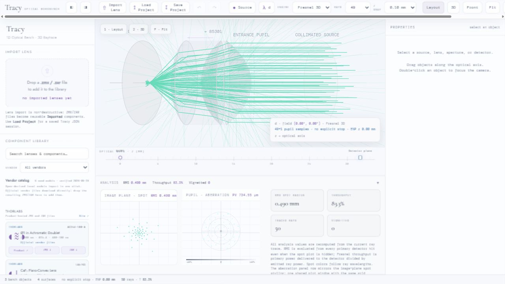

_The default workbench in Layout view. Light travels from the labeled source through the lens to the detector; the camera can make this appear right-to-left on screen._

| Area                     | What you use it for                                                                                                                                          |
| ------------------------ | ------------------------------------------------------------------------------------------------------------------------------------------------------------ |
| Top toolbar              | Import or save files, undo edits, choose light settings, and change the camera.                                                                              |
| Left panel               | Search the component library, browse catalog models, and select placed objects under **Bench objects**. Scroll inside this panel to reach the lower entries. |
| Center viewport          | See rays and optics. Drag a library card here to add an object; click a placed object to select it.                                                          |
| Ruler below the viewport | Read positions along the **z** optical axis. Its markers also select objects.                                                                                |
| Properties on the right  | Edit the selected source, lens, aperture, or detector.                                                                                                       |
| Analysis below the ruler | Inspect the spot, relative optical paths, and numeric results. Click the **Analysis** header to collapse or expand it.                                       |
| Bottom status bar        | See object and surface counts, the entrance-pupil position, traced rays, and the selected object.                                                            |

The two small panel buttons beside the brand toggle **Component library** and **Properties**. On a narrow window, the panels start collapsed and some toolbar buttons show only icons. Scroll the toolbar horizontally to reach controls such as **View** and the theme button. Hover over an icon for its description.

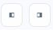

_Left button: Component library. Right button: Properties._

The bottom **ENP** value is the entrance pupil's **position**, not its diameter. The object count includes the source; a project-save message counts the lens/aperture/detector components separately.

## Add and edit lenses

### Place a component

1. Find a card in the left **Component Library**. Clear the search box if the component you want is missing.
2. Drag the card into the central viewport and release near the optical axis. A click on the card alone does not place it.
3. Select the new object in the viewport or under **Bench objects**.
4. Use **Axis z** for a precise position, or drag the placed object along the axis. The workbench keeps components on the common axis and prevents overlapping placements.

**Z snap** sets the position grid. With **0.10 mm** snap, entering **32.77 mm** becomes **32.80 mm**. Use a finer snap for smaller adjustments. If a position does not stick, also check for neighboring optics and the detector's required position after the optics.

### Edit a built-in singlet or achromat

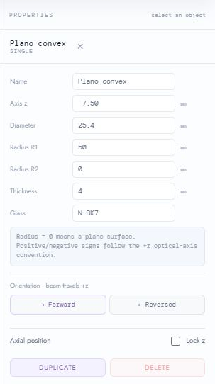

_Properties for a built-in singlet: shape and glass fields above, orientation and object actions below._

| Property           | Meaning                                                                                        |
| ------------------ | ---------------------------------------------------------------------------------------------- |
| **Name**           | Your label for the object.                                                                     |
| **Axis z**         | Position along the bench, in millimeters.                                                      |
| **Diameter**       | The lens opening used by the model.                                                            |
| **Radius R1 / R2** | Curvature of each singlet surface. **0** means a flat surface. Signs follow the +z convention. |
| **Thickness**      | Distance through the singlet along the axis.                                                   |
| **Glass**          | Material name, such as **N-BK7**. Choose a known entry from the suggestions.                   |

A singlet is one lens element. An **Achromat** combines two glasses and adds **Radius R3**, **Crown t**, **Flint t**, **Glass 1**, and **Glass 2**. Change one property at a time and compare the analysis.

**Forward / Reversed** flips an orientable lens; **R** does the same when the object is selected and you are not typing in an input. **Lock z** prevents dragging and arrow-key movement. **Duplicate** creates another lens or aperture; **Delete** removes the selected one from the bench. **Undo** can restore those bench edits, and **Redo** reapplies them. The detector is protected from deletion and is not duplicated by the Duplicate action.

Undo is useful for bench edits, but it is not a saved project or a complete history of every toolbar setting. Loading a project clears the undo/redo history.

### Edit an imported assembly

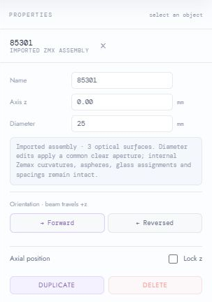

_The default `85301` is an imported assembly, so it has fewer editable shape fields than a built-in singlet._

An imported assembly exposes **Name**, **Axis z**, **Diameter**, and orientation. Changing its diameter applies a common clear aperture to its surfaces. Its internal curvatures, aspheres, glasses, and spacings stay as imported. To edit those values, change the source prescription and import it again.

### Move the detector to explore focus

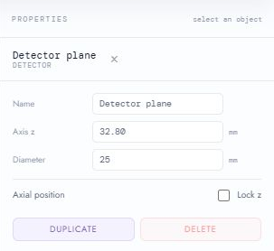

_Change **Axis z** in the detector's Properties._

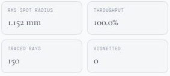

_In this separate example, Sequential tracing with F+d+C wavelengths gives **1.152 mm** RMS at **32.80 mm**. Undo restored **31.77 mm** and **0.527 mm** RMS. These values differ from the first exercise because the engine and wavelengths differ._

Select **Detector plane**, change **Axis z**, and compare RMS before and after. Keep the source, wavelengths, ray count, and engine unchanged while comparing positions. A position with a smaller spot in one setup may not be better for another source or wavelength.

## Control the light source

Click **Source** in the toolbar to open the light controls. Click it again, or click outside the popover, to close it. You can also select the source under **Bench objects** to enter its position or direction numerically in Properties.

### Collimated light

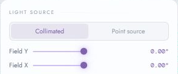

_Collimated light starts as a bundle of parallel rays._

1. Select **Collimated**.
2. Start with **Field X = 0°** and **Field Y = 0°** for on-axis light.
3. Move either field slider to explore light arriving at an angle. Watch the detector spot move or spread.
4. Return both fields to zero to recover on-axis illumination.

### Point source

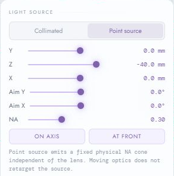

_A point source emits a cone from a finite location. In this example it is at z = −40 mm with NA = 0.30._

1. Select **Point source**.
2. Set **X**, **Y**, and **Z** to move the source. **Z** moves it along the bench.
3. Use **Aim X / Aim Y** to steer the cone.
4. Adjust **NA** to change its angular spread: a larger NA makes a wider cone.

**On axis** resets X and Y to zero. **At front** places the source 20 mm before the first surface and centers it on the axis. These buttons do not reset its aim angles. Moving a lens does not automatically aim the point source at the new lens position.

### Sampling and ray count

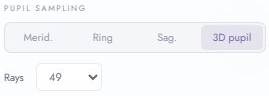

_Choose the sample pattern, then the number of rays per wavelength._

| Source control            | Use it to                                                                           |
| ------------------------- | ----------------------------------------------------------------------------------- |
| **3D pupil**              | Sample across the full circular opening; a useful starting point for spot analysis. |
| **Merid.**                | Show a line of samples across the Y direction.                                      |
| **Sag.**                  | Show a line of samples across the X direction.                                      |
| **Ring**                  | Sample around the outer edge.                                                       |
| **Rays**                  | Choose sample density. Start with 49 or 97 for responsive interaction.              |
| **Chief ray**             | Add a central reference ray for each active wavelength.                             |
| **Vignetted rays**        | Show faint paths for rays reported as vignetted.                                    |
| **Detector spot diagram** | Show or hide the spot display; RMS still updates when it is hidden.                 |

Ray count is **per wavelength**. With 49 samples and Chief ray enabled, one wavelength traces **50** rays; F+d+C traces **150**. Increasing ray count samples the same setup more densely; it does not physically improve the lens. Dense bundles use thinner display lines.

## Choose wavelengths

Click the **λ** button next to Source. Its text changes to show the active wavelengths.

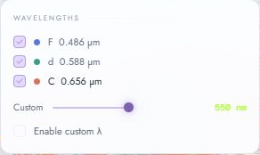

_F+d+C lets you compare three colors of light through the same optics._

1. Start with **d** alone for a simple view.
2. Enable **F** and **C** to compare the rays and detector hits for three wavelengths.
3. For another visible wavelength, move **Custom** between **380 and 700 nm**, then check **Enable custom λ**. Moving the slider alone does not enable it.

The standard labels are approximately **F = 486 nm**, **d = 588 nm**, and **C = 656 nm**. The popover expresses them in micrometers: **0.588 µm = 588 nm**. Glass bends different wavelengths by different amounts, so changing wavelengths can change the measured spot.

Keep at least one wavelength selected. If all are unchecked, Tracy falls back to the d wavelength. Ray and spot colors identify wavelengths; their brightness is a display style, not an optical-power reading.

## Choose an engine and read the analysis

Choose **Engine** in the toolbar, or select the engine in **Source**.

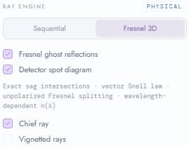

_The Source popover groups the engine and ray-display options. Fresnel 3D is selected in this detail._

| Engine         | What it does                                                                                   | Useful first use                                                      |
| -------------- | ---------------------------------------------------------------------------------------------- | --------------------------------------------------------------------- |
| **Sequential** | Follows rays through the ordered surfaces using refraction, without Fresnel reflection losses. | Explore geometry and compare detector positions with a simpler trace. |
| **Fresnel 3D** | Includes transmitted/reflected power at interfaces and can display reflected branches.         | Inspect transmission loss and possible ghost paths.                   |

In Source, **Fresnel ghost reflections** controls the reflected branches in the Fresnel engine. Turning it off simplifies the trace; it does not remove Fresnel losses from the primary transmitted rays.

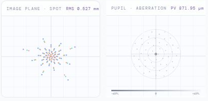

_Left: detector hits. Right: relative optical paths across the pupil._

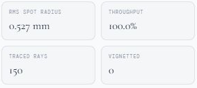

_The same default bench with three wavelengths and Sequential tracing: 150 rays, 0.527 mm RMS, and 100.0% throughput in this captured example._

| Result                 | How to read it                                                                                                                                                                                      |
| ---------------------- | --------------------------------------------------------------------------------------------------------------------------------------------------------------------------------------------------- |
| **Image plane · spot** | Each plotted point shows a ray hit on the detector. Colors follow wavelengths.                                                                                                                      |
| **RMS spot radius**    | A measure of spread around the hit cloud's center, weighted by ray power. Smaller means more tightly grouped hits for that setup. It can change between engines because their power weights differ. |
| **Throughput**         | Primary power reaching the detector divided by emitted ray power. Sequential tracing omits Fresnel reflection losses, so 100% here is not a prediction of real hardware efficiency.                 |
| **Traced rays**        | Total emitted primary rays across all selected wavelengths, including optional chief rays. It is not the count of all visible ghost branches.                                                       |
| **Vignetted**          | Number of primary rays the trace reports as vignetted. Inspect source alignment and apertures when it rises.                                                                                        |
| **Pupil · aberration** | Relative optical-path diagnostics across the sampled pupil. **PV** is the peak-to-valley spread; **ΔOPL** denotes a path-length difference.                                                         |

The aberration plot compares paths with the chief or nearest-axis ray at each wavelength. It is not a reference-sphere wavefront measurement, a diffraction image, or an MTF result. Use it to explore changes in the current model, not to certify optical quality.

## Add an aperture stop

An aperture stop is an opening that limits which rays pass through the optical system.

1. Clear the library search and find **Aperture stop** under **Apertures**.
2. Drag it onto the bench, for example before the first lens.
3. Select it and set **Clear Ø** to the opening diameter in millimeters.
4. Compare the ray bundle and spot. Use **Undo** to remove the trial addition.

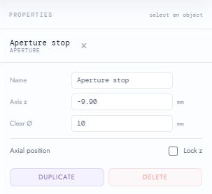

_Set **Clear Ø** to control the opening. Here the 10 mm stop is placed at z = −9.90 mm, before the first lens._

A bench aperture takes precedence over an imported stop for ray aiming. A narrower collimated bundle may show a smaller spot, but throughput is normalized to the rays emitted in the current simulation. Do not interpret an unchanged throughput percentage as unchanged total light collected from a real source. Diffraction is not modeled.

## Find or import a lens

### Search the vendor catalog

1. Type a name, glass, or stock number into **Search lenses & components…**.
2. Use **Vendor** to narrow the vendor catalog. Clear the search to see more library items.
3. Read the model's fidelity label before choosing it.

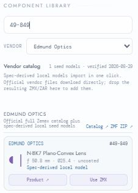

_Search for `49-849` and choose Edmund Optics to find this bundled example._

**Use ZMX** imports a bundled, **Spec-derived local model** into the library. The button changes to **In library**; find the new card under **Imported** and drag it onto the bench. The seed model is derived from published specifications and is not an official vendor Zemax file.

**Product ↗** opens the vendor's product page. The Thorlabs **ZMX ↓ / ZAR ↓** links open official vendor files; download one, then import it into Tracy. Edmund's **ZMF ZIP ↗** is a full catalog for compatible Zemax software; Tracy cannot import ZMF archives. See the [catalog reference](catalog.md) for provenance and maintenance details.

### Import your own ZMX or ZAR

1. Click **Import Lens** (the **⇧** icon in a compact toolbar), or use the file-drop area in the left panel.
2. Choose a `.zmx` or supported `.zar` file. For a first try, use the repository's [plano-convex example](../examples/plano-convex.zmx).
3. Look for the success message **Added to Component Library**.
4. Search for **Example** to find **Example plano-convex singlet**, then drag its card onto the bench when you want to use it.

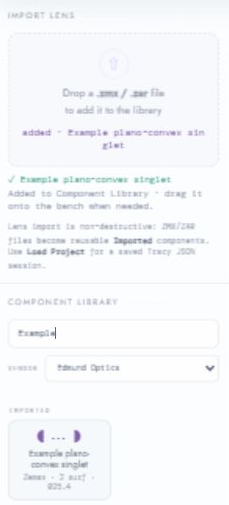

_Import success adds a reusable library card. The existing bench remains in place._

The imported prescription's final image plane is omitted; Tracy retains its own detector. To study the example by itself, save your current work, delete the default `85301` assembly, place the imported singlet, and keep the detector. This example declares a **10 mm entrance pupil**, while its physical clear aperture is **25.4 mm**; those are different quantities. Move the detector to explore its focus.

Supported designs use **STANDARD** or **EVENASPH** surfaces. Unsupported surfaces generate an import error. Binary ZOS designs, ZMF catalogs, coordinate breaks, and other surface types are not supported. For an unknown glass, Tracy warns and uses a fallback refractive index of **1.52**, so results need extra care.

## Save and reopen your work

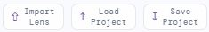

_From left to right: add a lens, reopen a session, and save the current session._

| Button                   | File                       | Effect                                                                           |
| ------------------------ | -------------------------- | -------------------------------------------------------------------------------- |
| **Import Lens** / **⇧**  | `.zmx` or supported `.zar` | Adds a reusable lens to the library.                                             |
| **Save Project** / **↧** | Downloads `.tracy.json`    | Saves the current bench, imported library lenses, simulation settings, and view. |
| **Load Project** / **↥** | A saved project `.json`    | Replaces the current session and clears its undo/redo history.                   |

**To save:**

1. Click **Save Project** or press **Ctrl+S** (Mac: **Cmd+S**) while focus is outside an input.
2. Look for the **Project saved** message.
3. Confirm the `.tracy.json` file appears in your browser's Downloads or chosen save folder. The name includes the bench name and a timestamp.
4. Keep that file before refreshing, closing the tab, or trying another project. Use a new saved file for a comparison you want to preserve.

**To reopen:**

1. Save the current session first if you want to keep it.
2. Click **Load Project** or press **Ctrl+O** (Mac: **Cmd+O**).
3. Select the saved `.tracy.json` file.
4. Look for **Project restored** in the left panel. Check the bench objects and source settings before continuing.

Projects include component geometry and positions, pupil metadata, imported library items and custom glasses, source and tracing settings, Z snap, camera, panel visibility, and theme. A lens import and a project load are different actions; use the matching button for the file you have.

**Try the included example:** use **Load Project** to open [examples/two-lens.tracy.json](../examples/two-lens.tracy.json). It contains the two Edmund Optics #49-847 lenses and detector shown in the README, with the light settings, imported lens model, camera, and Night theme already saved. Save any current work before loading it.

## Change the view

Camera changes help you inspect the same optical setup; they do not change the optical prescription.

| Control                       | Result                                                          |
| ----------------------------- | --------------------------------------------------------------- |
| **Layout** / **1**            | Side view for working along the optical axis.                   |
| **3D** / **2**                | Oblique view of the lens shapes and ray paths.                  |
| **Front** / **3**             | View along the optical axis.                                    |
| **Fit** / **F**               | Reframe the bench when objects are difficult to find.           |
| Drag empty viewport space     | Orbit the camera. Dragging an object instead moves that object. |
| Mouse wheel over the viewport | Zoom.                                                           |
| Double-click a placed object  | Focus the camera on that object.                                |

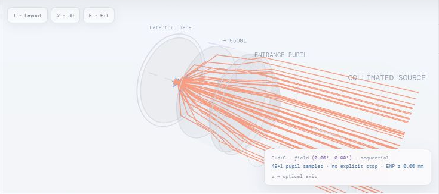

_3D view helps distinguish the surfaces and their depth._

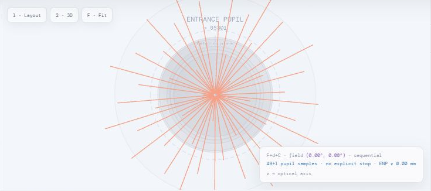

_Front view is useful for seeing the transverse arrangement of the ray bundle._

### Geometry display

Open **View** (the **⚙** button).

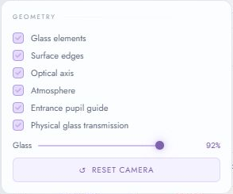

Toggle **Glass elements**, **Surface edges**, **Optical axis**, **Atmosphere**, and **Entrance pupil guide** to simplify the picture. **Physical glass transmission** and the **Glass** slider control the rendered glass appearance. They do not change the glass prescription or simulate adding a coating. **Reset camera** returns to the default camera pose.

### Day and night

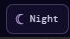

Click the **Day/Night** button at the far right of the toolbar, or press **T**, to switch themes. The button displays the current theme. The theme is remembered in this browser and is included in a saved project.

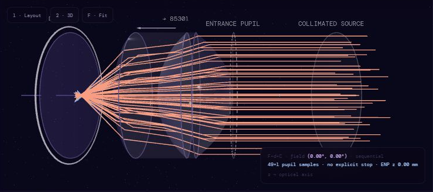

_The optical layout in Night mode._

For more viewport space, collapse the library, Properties, or Analysis and click **Fit**. Reopen those panels with the same controls when you need them.

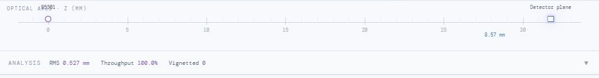

_The collapsed Analysis header keeps its key results visible beneath the ruler. Click the header to reopen the plots._

## Keyboard shortcuts

Click a toolbar button or another non-input area before using shortcuts. Inputs keep their normal typing behavior.

| Shortcut                           | Action                                                         |
| ---------------------------------- | -------------------------------------------------------------- |
| **1 / 2 / 3**                      | Layout / 3D / Front.                                           |
| **F**                              | Fit the bench.                                                 |
| **T**                              | Switch theme.                                                  |
| **R**                              | Reverse the selected orientable component.                     |
| **← / →**                          | Move the selected unlocked component by one Z snap step.       |
| **Shift+← / →**                    | Move by ten snap steps.                                        |
| **Alt+← / →**                      | Move by a requested tenth-step, subject to the placement grid. |
| **Ctrl+Z** / **Cmd+Z**             | Undo a recorded edit.                                          |
| **Ctrl+Shift+Z** / **Cmd+Shift+Z** | Redo.                                                          |
| **Ctrl+S** / **Cmd+S**             | Save project.                                                  |
| **Ctrl+O** / **Cmd+O**             | Load project.                                                  |

## Troubleshooting

| What you see                                       | What to try                                                                                                                            |
| -------------------------------------------------- | -------------------------------------------------------------------------------------------------------------------------------------- |
| The browser cannot open localhost:5173.            | Start `npm run dev` in the project folder and leave the terminal running. Check its printed address or error.                          |
| The interface opens but the viewport is blank.     | Use the HTTP address, confirm `npm ci` completed, and use a browser with WebGL enabled. Save before reloading.                         |
| Library or Properties is missing.                  | Use the two panel-toggle icons beside the brand. Narrow windows start with those panels collapsed.                                     |
| A toolbar button is missing.                       | Scroll the top toolbar horizontally; a compact window may show only its icon.                                                          |
| An imported lens is not on the bench.              | Import adds a library card. Find it under **Imported**, then drag it into the viewport.                                                |
| A component is missing from the library.           | Clear the search box; check the vendor filter for catalog results.                                                                     |
| A component will not move as expected.             | Check **Lock z**, **Z snap**, neighboring optics, and the detector's position after the optics.                                        |
| The spot is empty or RMS shows **—**.              | Check that rays reach the detector. Inspect source position/aim, aperture size, and detector placement; use **Fit** to see the system. |
| Rays disappear after switching to Point source.    | Check **Z**, **Aim X/Y**, and **NA**. The emission cone is not automatically retargeted when optics move.                              |
| The spot looks equally large after changing focus. | Compare numeric RMS and plot scale labels: the plot automatically rescales.                                                            |
| The scene is slow or visually crowded.             | Reduce **Rays** to 49 or 97; use fewer wavelengths; turn off ghost display or try Sequential tracing.                                  |
| A file import fails.                               | Read the error below Import Lens. Check the file type and supported surface types; a ZMF ZIP is not a ZAR file.                        |
| A saved session did not reappear after refreshing. | Use **Load Project** with your saved JSON. Refreshing does not restore an unsaved bench.                                               |
| A keyboard shortcut does nothing.                  | Move focus outside text fields, sliders, and selects, then try again.                                                                  |

## Units and useful terms

| Term                     | Meaning in Tracy                                                                                                             |
| ------------------------ | ---------------------------------------------------------------------------------------------------------------------------- |
| **mm**                   | Millimeters; the unit for positions, lens sizes, and most spot radii.                                                        |
| **µm / nm**              | Micrometers / nanometers. **1 µm = 1,000 nm**; **1 mm = 1,000 µm**. Read the unit printed beside each value.                 |
| **z axis**               | The shared line on which the optical components sit. The beam travels in the +z direction.                                   |
| **Ø**                    | Diameter.                                                                                                                    |
| **Clear aperture**       | The usable opening of a surface or stop.                                                                                     |
| **Entrance pupil / ENP** | The system stop as viewed from the incoming-light side. Its apparent position and size can differ from the physical opening. |
| **NA**                   | Numerical aperture; in Point source mode it sets the cone's angular spread.                                                  |
| **Ghost**                | An additional ray path created by reflections between surfaces.                                                              |
| **Vignetting**           | Loss of rays reported by the trace, often associated with clipping at an opening.                                            |

Tracy is a simulation workbench with coaxial components. It does not support arbitrary lens decenter or tilt, and does not model diffraction, coatings, absorption, polarization-dependent behavior, or coherent interference. Its optical results have not been certified against an independent commercial solver. See [engineering limits](technical-reference.md#engineering-limits) and [verification](verification.md) for the current scope.
