# Tracy: an illustrated working tutorial

This guide uses the **85301 doublet** included on the default bench. You will inspect it, define the light, compare detector positions and save a project called **Tutorial doublet**. Each workflow has a day-mode screenshot; expand its night-mode view to see the same controls in the other theme.

Open the [hosted application](https://tracy-optical-workbench.quantumsensing.chatgpt.site) with the Site owner's account, or follow [Run locally](../README.md#run-locally). A WebGL browser is required. If Tracy recovers an earlier autosave, it opens that working project instead of replacing it with the default doublet.

The overview starts with d-line light, 49 analysis samples and the Fresnel engine. **Fresnel ghost reflections** is unchecked for visual clarity; it is available under **Source → Source & sampling**. Hiding ghost paths does not change the primary spot and power metrics.

The catalog and analysis screenshots were refreshed for H007's online search and wavefront plot; other views remain historical captures from `f5d3abd`. The hosted copy remains at the earlier `7bfee` revision; this repository update does not redeploy it. Capture conditions and source hashes are recorded in [the screenshot notes](images/tutorial/README.md).

## 1. Get oriented

1. Find **System / Bench** at left, the optical view and axial ruler in the center, **Properties** at right, and **Analysis** below the view.
2. Click **85301** or **Detector plane** in the bench tree to select it. The Catalog has its own tab, so the system is always reachable without scrolling through lenses.
3. Open **View** and choose **Layout**, **3D**, **Front** or **Fit**. The **Day / Night** button switches theme; **T** does the same when you are not editing text.
4. Use the Analysis header to collapse or reopen the drawer. Scroll inside Analysis to reach its tables and tools. On a narrow screen, the two buttons beside Tracy open the system/catalog and Properties docks.

See the workbench in night mode

## 2. Add a component

1. Choose **Catalog → Search online catalogs**. Select Edmund Optics or Thorlabs, enter a stock number or optical specification, and click **Search supplier** to open its current results. For example, search Thorlabs for **AC254-075-A**. Results are on the supplier site, not a fixed list in Tracy.
2. Download a supported ZMX/ZAR prescription. Expand **Import a downloaded vendor model**, provide its official product URL and file, and inspect the import warnings. The link is user-supplied attribution, not vendor certification. Use **Filter local components…** for your imported models or generic primitives. Set **Insert at z (mm)**, then click a local card or focus it and press Enter/Space; dragging onto the optical axis also works.
3. Read the insertion toast and **Axis z** in Properties. The placement grid snaps the requested coordinate. Insertion preserves neighboring positions, including the detector. You can move each object past the others to rearrange the bench.
4. For the remaining default-doublet tutorial, undo this trial insertion with **Undo** or Ctrl/Cmd+Z.

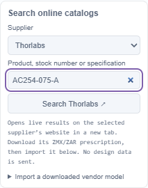

See online catalog search in night mode

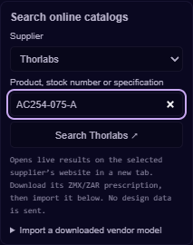

## 3. Edit properties and preserve imported apertures

1. Return to **System / Bench** and select **85301**. Inspect its **Name** and **Axis z** in Properties. **Forward / Reversed** changes assembly orientation; **Lock z** prevents axial dragging. If you try a placement or orientation change, undo it before continuing with the default-doublet example.
2. The default doublet is an imported assembly. Its individual surface apertures remain intact until you use **Override all clear apertures**. The illustration shows an intentional **25 mm** diameter override.
3. After an override, the inspector identifies the modified apertures. Choose **Reset to Imported Prescription** to restore the stored prescription before continuing with this tutorial.
4. Select **Detector plane** to edit its position independently. It can sit immediately after the last optical vertex, including gaps below 5 mm for short focal lengths. For a catalog singlet, Properties also exposes **Radius R1**, **Radius R2**, **Thickness** and **Glass**; a radius of zero means a plane surface.

For precise placement, type **Axis z** directly; typed coordinates bypass the placement grid. Select a lens, source or detector and press **Shift + Left/Right** for one tenth of the grid step (0.01 mm with the default 0.1 mm grid; minimum step 0.001 mm). **Shift + drag** slows axial motion to one tenth and uses the finer grid. **Alt + Left/Right** moves ten grid steps. Position readouts show up to six decimal places. Objects can cross and overlap while you edit; neighbors are never automatically relocated. If overlapping optics, a downstream source or an upstream detector prevents a supported +z trace, the result is blocked with a placement message. The layout still saves and undo remains available. Restore a supported arrangement to resume tracing. The older screenshots below predate these controls.

Select **Collimated source** to edit its **Launch plane → Axis z**, or switch to **Point** and edit **Position → Z**. Both source types support dragging and arrow keys. Moving the collimated launch plane changes where ray paths begin, while illumination stays parallel and the object remains at infinity. The point source changes its physical emission position.

Reset preserves the imported assembly's bench placement and orientation. For legacy v1 projects, the saved prescription is the recoverable baseline; earlier unrecorded aperture edits cannot be reconstructed. An aperture edit can expose an undefined lens-edge path, which Tracy reports rather than silently approximating.

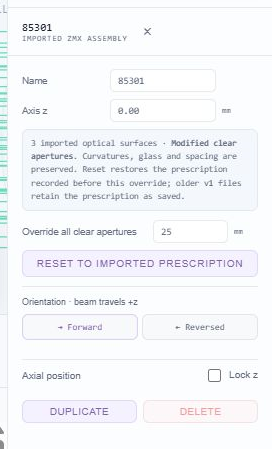

See imported properties in night mode

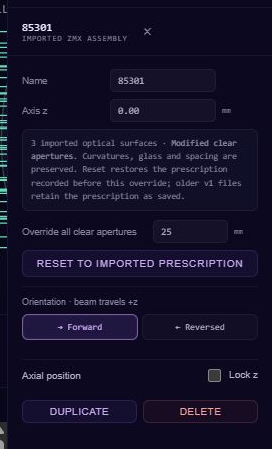

## 4. Define the source

1. Open **Source → Source & sampling**. Choose **Collimated** for parallel rays or **Point source** for a finite emitter.
2. For collimated light, edit **Field X / Field Y** in degrees. For a point source, edit its X/Y/Z position in mm, aim angles and air **NA**.
3. Select **3D pupil** for an area-sampled population. **Merid.**, **Sag.** and **Ring** are diagnostic sample patterns.
4. Return to the **Source** menu to choose **Point distribution**, **Collimated illumination**, the source/target disk dimensions and optional Gaussian weighting.

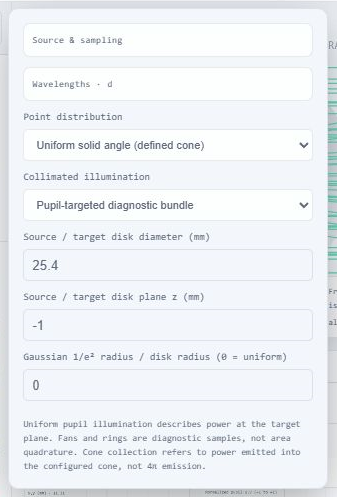

See source configuration in night mode

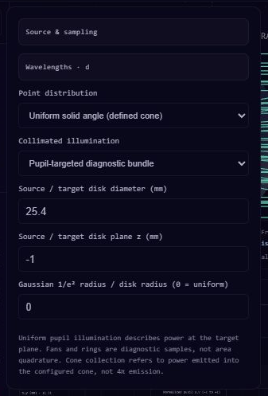

Choose the model that describes the experiment you intend to calculate:

| Source setting                             | Meaning and limit                                                                                                                                                 |
| ------------------------------------------ | ----------------------------------------------------------------------------------------------------------------------------------------------------------------- |
| **Pupil-targeted diagnostic bundle**       | Collimated rays target the modeled system pupil. Changing a stop can redefine the generated bundle; total source collection is not defined.                       |
| **Fixed source disk (collection enabled)** | The collimated illumination disk has its own diameter and z plane. With area sampling, a smaller stop rejects source samples rather than shrinking the source.    |
| **Uniform solid angle (defined cone)**     | Point-source power is uniform per solid angle within the chosen NA cone. The normalization is that cone's power, not full-sphere emission.                        |
| **Uniform polar angle (defined cone)**     | Power is uniform in polar-angle/azimuth coordinates. This is a different emission model from uniform solid angle.                                                 |
| **Uniform target pupil illumination**      | Point-source rays target an equal-area disk at the specified plane. The disk and source position determine directions; NA and aim angles do not define this mode. |

**Gaussian 1/e² radius / disk radius (0 = uniform)** reweights and normalizes the finite sample population. For angular sources it acts on the sampling coordinates; it does not establish a physical Gaussian-beam model. Custom nonnegative sample weights are available through the headless API. Fans and rings are discrete diagnostics, not area-integrated source collection.

## 5. Set wavelengths and source weights

1. Open **Source → Wavelengths**. Enable the F, d, C and/or custom wavelength entries you need.
2. Set the custom wavelength in nm if using it. F/d/C correspond approximately to **486.13 / 587.56 / 656.27 nm**.
3. Edit **Source spectral weights**. F/d/C initially have equal input weights; only enabled, positive-weight entries contribute to the calculation.
4. Read the normalized weights in Analysis's wavelength table. Keep them fixed when comparing detector positions.

All-zero active weights block a result. Equal F/d/C weights define a three-line source, not a white-light or photopic spectrum. Display colors distinguish wavelengths; they do not measure power.

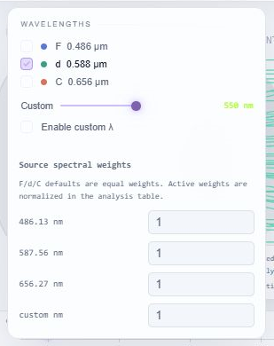

See wavelength weights in night mode

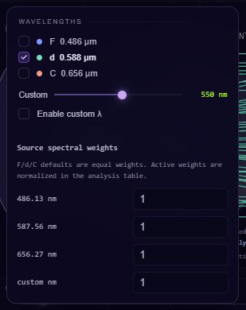

## 6. Choose tracing fidelity and sample counts

1. Open **Trace**. **Sequential geometric** follows the prescribed surface sequence without Fresnel power losses. **Uncoated Fresnel + Ghosts (Coaxial)** adds per-interface unpolarized Fresnel splitting and bounded ghost paths.
2. Set **Analysis samples per wavelength** for numerical sampling density. Set **Visible samples per wavelength** separately to keep the scene readable.
3. Leave **Materials → Strict engineering** selected for quantitative work. Read any material or topology warning beside Analysis.
4. Wait for the worker to finish after changes. A “Calculating…” state marks earlier numbers as stale.

Chief/reference rays have zero statistical weight: their display toggle cannot change RMS, survival or power. Increasing visible rays also cannot improve numerical sampling; increase the analysis count and check convergence instead.

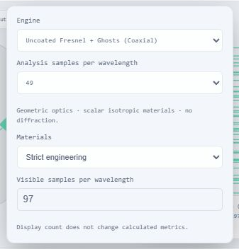

See trace settings in night mode

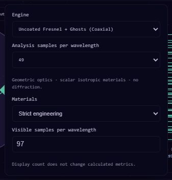

Strict mode blocks unresolved glasses and dispersion outside known validity ranges. **Exploratory fallback (approximate)** may use n = 1.52 for an unresolved glass or extrapolate a finite known fit, with persistent warnings. Unknown validity ranges and unverified provenance remain labeled. An anisotropic material represented by one scalar index is an isotropic approximation, not birefringent propagation.

## 7. Read the analysis and set useful scales

1. Choose **Analysis → Show analysis & focus tools**. The primary pupil map is **Wavefront error**. Select an active wavelength and **nm** or **waves**; RMS and PV use only that wavelength. An inactive selection shows an explanation rather than silently switching wavelengths.
2. The reference sphere follows the **current detector**. Piston is removed; **Remove fitted tilt** optionally subtracts a plane in normalized pupil coordinates. Defocus stays in the result, so moving the detector changes it. Focus Scan finds a sampled spot-RMS minimum, not a wavefront-RMS optimum, and requires an explicit detector move.
3. Expand **Plot scales & phase conventions**. Choose **Auto Scale** or **Lock Scale**; set **Spot half-span (mm)** and **WFE ±scale (nm)**. The latter remains a physical nm bound when the display is in waves. **Previous-result overlay** draws prior pupil values as outlines, for matching wavelength/removal conventions.
4. Use **Shared A/B Scale** for captured comparisons with matching pupil conventions. Select **Relative OPL diagnostic** to inspect the old launch-to-detector path difference in µm, with its separate locked scale. It is not wavefront error.

The screenshots use the default doublet at its existing detector, d-line illumination and **601 analysis samples** for a denser sampled map. Colors and legend show the same signed WFE scale. Points are actual calculated samples; missing/vignetted areas are not interpolated. Scroll inside Analysis for the scale controls and full conventions, including the actual sphere center, exit-pupil z and radius. Positive WFE means chief minus sample optical phase.

If WFE is unavailable, read its reason first. Enable the selected wavelength with positive source weight, or correct a blocked source/detector layout. Some valid spot traces still have no supported WFE reference, for example a blocked chief ray, an infinite exit pupil or a detector at the exit pupil. Relative OPL can remain available in such cases but is a different quantity. Increase analysis sampling and compare surviving samples before interpreting RMS/PV changes as an improvement.

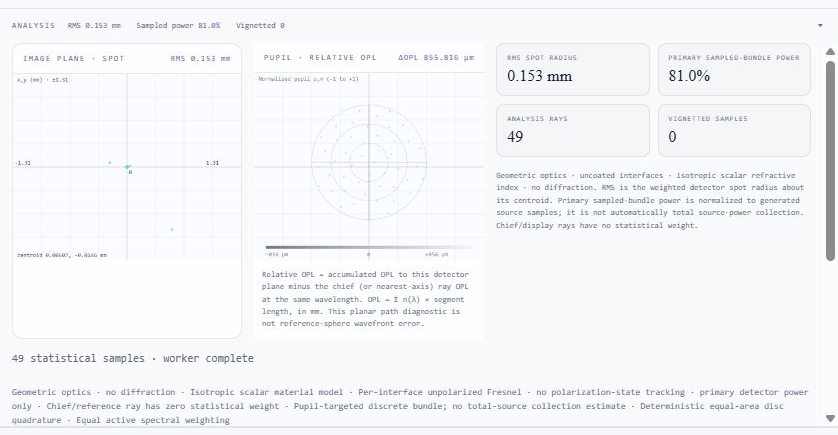

See the analysis plots in night mode

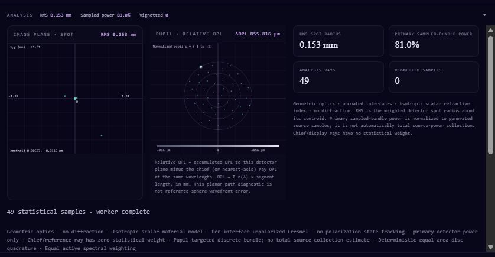

| Result                             | Read it as                                                                                                                                                                                                           |
| ---------------------------------- | -------------------------------------------------------------------------------------------------------------------------------------------------------------------------------------------------------------------- |
| **RMS spot radius**                | Weighted radius about the detector centroid, in mm or µm; not spot diameter or diffraction resolution.                                                                                                               |
| **Bundle survival**                | The normalized source/spectral weight of primary rays reaching the detector, before Fresnel losses.                                                                                                                  |
| **Primary sampled power**          | Surviving source weight × spectral weight × Fresnel power. Sequential mode models geometric survival only.                                                                                                           |
| **Fresnel factor among survivors** | Sampled power divided by survival, conditional on reaching the detector.                                                                                                                                             |
| **Collection of defined source**   | Primary power normalized to the specified independent disk or point-source population with area sampling. “Not defined” for pupil-targeted collimated bundles and diagnostic fans/rings.                             |
| **Relative OPL**                   | Accumulated optical path minus a same-wavelength central reference, displayed in µm. It is not reference-sphere wavefront error.                                                                                     |
| **Wavefront RMS / PV**             | Reference-sphere phase departure after the stated piston/tilt removal, at one wavelength. Equal surviving sample weights; not Fresnel/power weighted. Angular/fan samples are diagnostic rather than pupil-area RMS. |

Spot coordinates retain the detector-axis frame, so centroid shifts remain visible. A smaller-looking auto-scaled plot is not evidence of a smaller physical spot. Undefined **primary** lens-edge paths block quantitative aggregation; an incomplete **ghost** path can leave primary metrics available with a warning. Ghosts are bounded display diagnostics and do not enter primary spot/power statistics.

## 8. Find the best tested detector position

1. Keep the default doublet and detector positions. Set **Collimated** light with **Field X / Field Y = 0°**, d-line only, 49 analysis samples and the Fresnel engine. Wait for the baseline result, then open **Analysis → A/B system comparison** and **Capture A** before moving the detector.
2. Choose **Analysis → Focus Scan**. Enter **From z (mm): 30**, **To z (mm): 45** and **Steps: 7**, then click **Run Focus Scan**. These illustrative settings sample the interval at 2.5 mm spacing.
3. Read the RMS-versus-z curve, reported lowest tested point and settings summary. Expand **Numeric scan samples and survival** to check whether clipping changes across the interval.
4. Refine the interval and increase the steps if needed. A minimum at either boundary is a reason to investigate beyond that boundary, not evidence of a completed focus search.
5. To reproduce the comparison in step 9, scroll below the curve and choose **Move detector to tested minimum**. Alternatively, enter **Selected z (mm)** and use **Move detector to selected z**. Running the scan alone does not move the bench detector.

**This coarse scan does not improve the baseline.** Its lowest tested RMS is **495.494 µm (about 0.495 mm) at z = 32.500 mm**. The original detector at about **31.767 mm** gives **0.153 mm RMS**. The 2.500 mm grid skips that original position. Refine around the promising region, or use **Restore A** after the comparison to recover the better baseline.

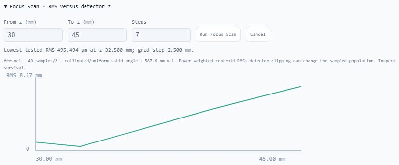

See Focus Scan in night mode

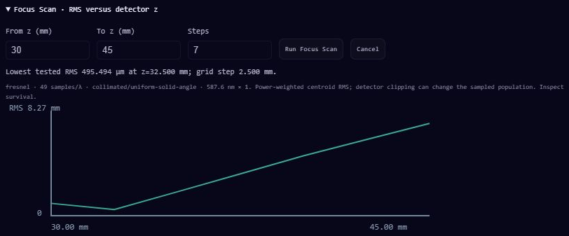

The scan evaluates the current source, spectrum, material policy and sample count at each z. It reports a **best tested grid point**, not a continuous fitted optimum. A lower RMS caused by clipping marginal rays may reduce useful collection, so inspect survival and power. A valid focus scan must remain after the optics; there is no fixed detector clearance. Bench placement and **Move detector to selected z** allow any finite position, with unsupported layouts reported by tracing. If you inserted another component earlier, choose an interval suitable for that new system.

## 9. Compare A and B

1. Keep **A** from step 8: the default doublet with its original detector position. If you are starting here, capture that baseline before changing anything.
2. After moving the detector to **32.5 mm** in step 8, wait for the completed result, open **Analysis → A/B system comparison**, and select **Capture B**. If you have not moved it yet, set the detector's **Axis z** to 32.5 mm first.
3. Read the table's geometry, detector position, RMS, bundle survival, sampled power and wavelength results. Check that source and spectral settings still match your comparison's intent.
4. Choose **Shared A/B Scale** under the plot-scale controls to compare plots with common bounds. Use **Restore A** or **Restore B** to return to either captured system.

The cropped screenshots show numerical rows from the table, whose column order is **Quantity, A, B**. **Left values are A**, the baseline at about **31.767 mm**; **right values are B**, at **32.5 mm**. Both have **100% bundle survival** and **81.04% primary sampled power**, while B has the larger RMS. Geometry, table headers and capture/restore controls are outside these crops.

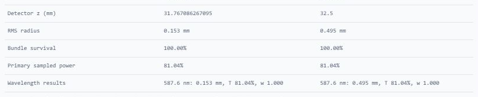

See A/B comparison in night mode

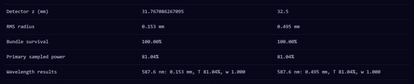

A/B snapshots last for the current session. Export each restored project as a separate JSON file if you want to retain both permanently.

## 10. Save the tutorial and recover your work

1. Open **Project**, enter **Tutorial doublet** in **Local project name**, and click **Save named project**.
2. Watch the toolbar status. It distinguishes **Unsaved changes**, **Saving locally…**, **Autosaved locally** and **Local save failed**.
3. To reopen a named project, choose it under **Saved on this device**, then click **Open named project**. **New local copy** gives the current bench a separate identity; rename and save that copy.
4. Choose **Export Project JSON** for a portable backup. Use **Import Project JSON** to restore a saved file, including supported imported prescriptions, custom glass metadata and simulation settings.
5. After autosave completes, reload to recover the last committed working session. The recovery status identifies that restoration.

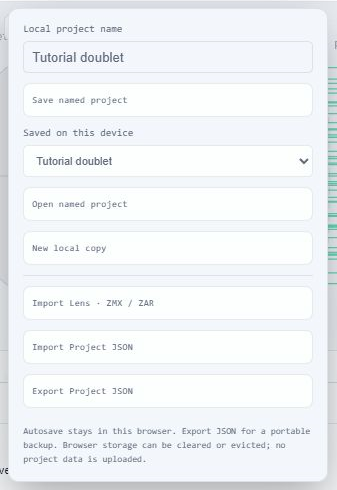

See local projects in night mode

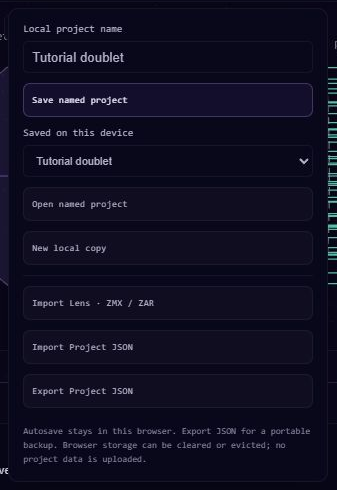

Autosave is the working-session recovery record; a named save is a snapshot. Switching projects preserves the outgoing draft. Storage belongs to this browser profile and site origin, so localhost and the hosted site have separate local projects. Browser clearing, eviction or private-session termination can remove them, and an immediate crash can precede a pending write. Export JSON for durable backups. Version 1 files migrate to version 2; see [local project details](local-projects-and-workflows.md).

## 11. Import another optical prescription

1. Download the bundled [examples/plano-convex.zmx fixture](../examples/plano-convex.zmx). Choose **Project → Import Lens · ZMX / ZAR** and select it, or drop the file onto the workbench.
2. Read the success message, then search the Catalog for **Example plano-convex**. A successful import adds its reusable card under **Imported**; it does not replace the current bench.
3. Set **Insert at z (mm)** and click the imported card, or drag it onto the axis. Inspect its placement and original apertures before interpreting results.
4. If you intentionally change all imported clear apertures, use the explicit override/reset workflow in step 3. Save or export the project to retain the imported library and glass metadata.

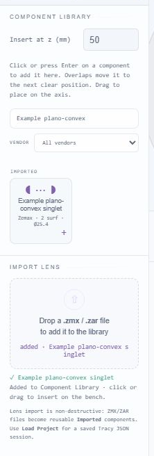

See lens import in night mode

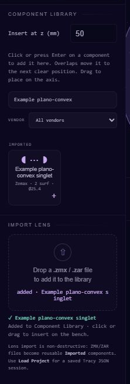

Tracy accepts supported text ZMX prescriptions and supported ZMX/AGF members in ZAR archives. A binary ZOS-only archive needs a text ZMX export. Unsupported optical surface types fail explicitly. Imported pupil metadata stays with its assembly; material provenance identifies embedded AGF sources. Bundled vendor models retain their spec-derived/official-file labels. External product/download links are user-triggered; your design is not uploaded to vendors.

## Keyboard reference

| Action                       | Key                                                                 |
| ---------------------------- | ------------------------------------------------------------------- |
| Navigate / activate controls | Tab, Enter, Space; Escape closes menus                              |
| Layout / 3D / Front / Fit    | 1 / 2 / 3 / F                                                       |
| Switch day/night theme       | T                                                                   |
| Reverse selected assembly    | R                                                                   |
| Move selected component      | Left/Right arrows; Shift = 0.1× step (min 0.001 mm), Alt = 10× step |
| Fine axial drag              | Hold Shift while dragging a lens, source or detector                |
| Remove selected component    | Delete; the single detector is retained                             |
| Undo / redo bench edit       | Ctrl/Cmd+Z / Ctrl/Cmd+Shift+Z                                       |
| Export / import project JSON | Ctrl/Cmd+S / Ctrl/Cmd+O                                             |

Text fields retain their ordinary editing behavior. Set the movement step with **View → Axial placement grid**.

## Model limits and troubleshooting

Tracy models **coaxial geometric optics**, scalar refractive indices and uncoated per-interface unpolarized Fresnel power. It does not provide decenter/tilt, coatings, bulk absorption, polarization-state propagation, diffraction, reference-sphere wavefront error, PSF or MTF. Numerical agreement in the validated domain is not a physical hardware measurement or calibration.

| If you see…                     | Next action                                                                                                                      |
| ------------------------------- | -------------------------------------------------------------------------------------------------------------------------------- |
| A blocked quantitative result   | Read the material/topology/source message and correct the prescription or configuration. Do not interpret earlier stale numbers. |
| An approximate-material warning | Check provenance and wavelength validity; exploratory output remains approximate.                                                |
| No detector hits                | Inspect source direction, component apertures, detector size and position.                                                       |
| A suspiciously better RMS       | Check survival/power and compare with a locked/shared scale; clipping can shrink the surviving spot.                             |
| Local save failed               | Export Project JSON before leaving and inspect the status tooltip.                                                               |
| The application will not start  | Use a WebGL-capable browser and serve over HTTP; opening `index.html` directly is insufficient.                                  |

For equations and validity limits, read [physics definitions](physics-definitions.md). For independent evidence, see [external validation](external-validation.md) and [verification](verification.md). Contributors can follow the [README validation commands](../README.md#validate-and-contribute); engineering continuity follows [PROJECT.md](../PROJECT.md), [STATE.md](../STATE.md) and the [agentic-engineering-template records](../records/RECORDS.md).
