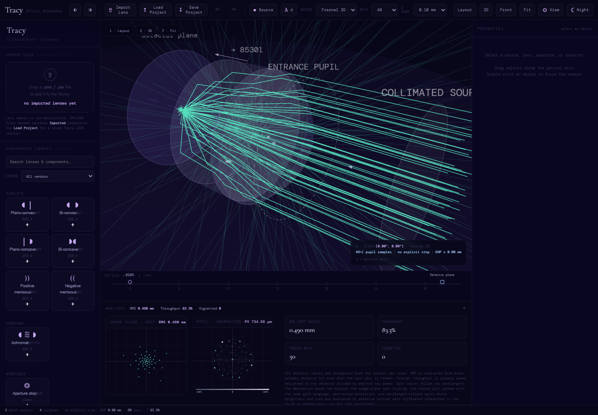
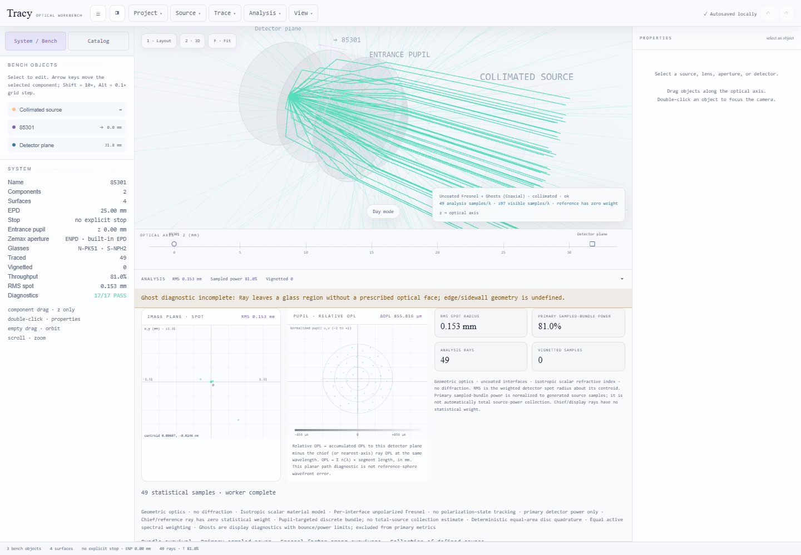
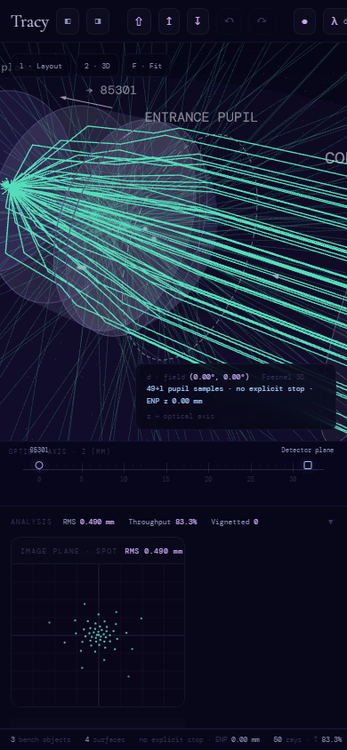
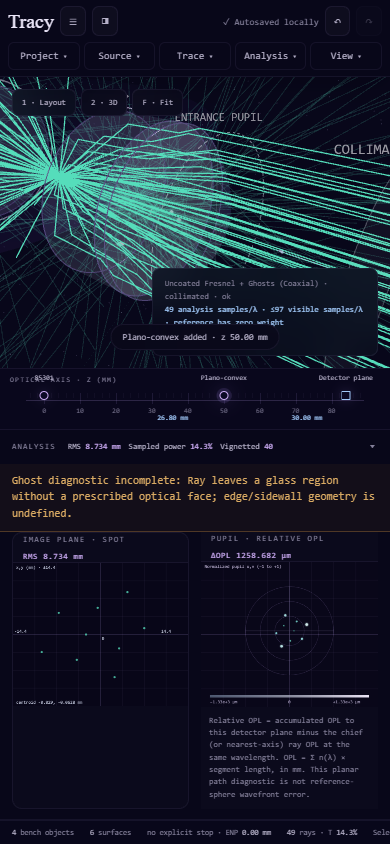

# Engineering report

Status: **VALIDATED within the documented P0/P1 scope**. Implementation, local checks and owner-private static publication succeeded. Evidence establishes supported coaxial geometric optics, not measured hardware performance.

The authoritative acceptance criteria are [PROJECT.md](../PROJECT.md) and the [user brief](../docs/engineering-brief.md). Current checkpoint: [STATE.md](../STATE.md). Evidence: [records](../records/RECORDS.md).

Free rearrangement follow-up (H006/E013): lenses, point sources, collimated launch planes and detectors can pass other objects without moving their neighbors. Complete optical prescriptions reorder by axial position. Unsupported or overlapping layouts remain editable and saveable, with explicit blocked trace results until the layout is valid. Shift precision, undo, export and recovery are preserved. Collimated source z now sets the actual launch plane (default −40 mm); the object stays at infinity. Empty source input reports invalid data without crashing. Validation covers 116 Node tests, 1,504 independent comparisons and 14 production-browser workflows in the [rearrangement report](rearrangement-browser-results.json). README and workflow instructions are updated; historical day/night screenshots retain their capture provenance. This repository update does not redeploy the Site.

Earlier precision follow-up (H005/E012): removed the old 5 mm detector spacer, added Shift fine keyboard/drag movement and preserved typed coordinates to six decimal places. Close focus movement, undo, export and reload retain geometry. Its remaining neighbor constraints and insertion relocation are superseded by H006. Historical checks passed 113 Node tests, 1,504 independent comparisons and 12 production-browser workflows in the [positioning report](positioning-browser-results.json).

Main integration review (H004/E011): the single feature branch contains all unmerged work and can be fast-forwarded without conflicts. Renewed checks pass: 104 Node tests, 1,504 independent comparisons, lint/types/catalog/build/format, 60 documentation links and all 22 tutorial images. The [production browser report](main-integration-browser-results.json) records 10/10 passing workflows in 89.413 seconds. No additional application fix was needed; source history and historical screenshots are preserved.

## Result and scope

Tracy 0.2.0 retains its native browser architecture and supported imports while separating physical calculations from display. Chief/reference rays have zero statistical weight; source quadrature, spectral weights and Fresnel power are separate. **Relative OPL** has an explicit equation and reference convention; it is never represented as reference-sphere wavefront error.

Strict material validation blocks unresolved/invalid dispersion. Exploratory fallback is explicit and persistently marked. Provenance, known wavelength ranges, unaudited legacy models and scalar crystal approximations remain visible. Manufacturer checks uncovered incorrect N-PK51 and S-NPH2 coefficients. Correcting them intentionally changes default results: S-NPH2's d-line index was about 1.81254 instead of 1.92286.

Fresnel branches carry physical region identity and validate boundary adjacency. Physical hit-to-hit OPL removes launch-offset bias. Undefined primary topology blocks quantitative aggregation; unsupported ghost-only edge paths produce a separate warning. No lens-sidewall geometry or complete ghost-inclusive collection is invented.

The interface now has grouped responsive menus, reachable bench/catalog tabs, click/keyboard/drag insertion, imported aperture override/reset, numeric locked/shared plot scales and overlays, a transparent focus grid scan, A/B snapshots, and IndexedDB autosave/recovery/named projects. Analysis and display ray counts are independent.

## Deliverables

| Required deliverable                       | Artifact                                                                                                                                                                                                                                    |
| ------------------------------------------ | ------------------------------------------------------------------------------------------------------------------------------------------------------------------------------------------------------------------------------------------- |
| Classified audit and metric traceability   | [Audit](../docs/audit.md), [core physics audit](../docs/core-physics-audit.md)                                                                                                                                                              |
| P0/P1/P2 roadmap                           | [Improvement plan](../docs/improvement-plan.md)                                                                                                                                                                                             |
| Definitions, units, weights and validity   | [Physics definitions](../docs/physics-definitions.md)                                                                                                                                                                                       |
| Independent fixtures and comparison report | [External validation](../docs/external-validation.md), [RayOptics fixtures](../tests/fixtures/reference-rayoptics.json), [machine comparisons](../tests/fixtures/reference-comparison.json), [generator](../scripts/reference-rayoptics.py) |
| Canonical simulation architecture          | [Architecture](../docs/architecture.md), [typed contract](../src/model/simulation-types.d.ts), [simulate](../src/core/simulate.js), [worker client](../src/core/worker-client.js)                                                           |
| Engineering workflows                      | [User guide](../docs/user-guide.md), [local projects/workflows](../docs/local-projects-and-workflows.md)                                                                                                                                    |
| Automated tests and CI                     | [Node tests](../tests), [browser tests](../e2e/workbench.spec.js), [CI](../.github/workflows/quality.yml), [verification](../docs/verification.md)                                                                                          |
| Contributor and technical documentation    | [README](../README.md), [technical reference](../docs/technical-reference.md)                                                                                                                                                               |
| Before/after screenshots and benchmarks    | Images and timing tables below, with raw evidence                                                                                                                                                                                           |
| Trust changelog                            | [CHANGELOG](../CHANGELOG.md)                                                                                                                                                                                                                |

The requested agentic-engineering-template workflow is preserved in AGENTS/PROJECT/STATE, durable records, and this report; its license is retained. Starting revision: `a5c94516578c8edf44743048e677f424e81d0b85`, initially clean, with 48 passing tests.

## Architecture and operation

[Open hosted Tracy](https://tracy-optical-workbench.quantumsensing.chatgpt.site). The Site remains owner-private and requires the owner's access. [Deployment evidence](deployment.json) records the earlier successful release at source `7bfee883020797977a9b17769811977f58a170bb`, version 1. The later Git review adds the worker-error and weak-primary fixes described below; this repository commit/push does not redeploy the Site. The static build needs no Node installation for browser users.

`UI actions → SimulationState → worker simulate() → SimulationResult → renderer / analysis UI`.

The canonical serializable snapshot owns source, spectrum, engine/material policy, sampling, surfaces/components, analysis and display settings. The pure numerical API has no DOM or Three.js dependencies. Renderers consume results. Worker termination and request versions prevent obsolete edits or scans from replacing newer state. Existing native-module components, importers and scene architecture are retained incrementally.

Environment: Windows x64, Node 24.14.1, npm 11.11.0; Three.js 0.128.0, TypeScript 5.9.2, Playwright 1.55.1. Contributors run `npm ci`, `npm run check`, `npx playwright install chromium`, `npm run test:e2e`, `npm run reference:check`. `npm run build` emits self-contained static `dist/`. There is no runtime CDN, cloud optical solver or application telemetry. Projects remain in local IndexedDB; export JSON for portable backup.

CI runs lint/type/unit/import/physics/catalog/build/format/reference/browser checks, plus a production Worker smoke test. GitHub's required-check branch-protection setting has not been changed; administrators must make the validation job required to enforce merge policy. A workflow file alone cannot enforce account policy or prove a remote run passed.

## Validation

The bounded follow-up review is recorded in [E009](../records/RECORDS.md#e009): two reproduced defects received minimal fixes, an unused assignment and five superseded screenshots were removed, and intentional optics, fixtures and historical images were preserved.

| Method                              | Result                                                                                       | Scope                                                                                                                                    |
| ----------------------------------- | -------------------------------------------------------------------------------------------- | ---------------------------------------------------------------------------------------------------------------------------------------- |
| Integrated `npm run check`          | **116/116 tests pass**; lint, type contract, catalog, clean static build and formatting pass | Free rearrangement, source launch validation, precision/short-focus optics, imports, storage, rendering contracts, worker races           |
| Independent comparison              | **1,504/1,504 comparisons pass**                                                             | RayOptics 0.9.8 / opticalglass 1.1.1; 90 exact rays over 10 prescriptions and three wavelengths, plus paraxial/analytic/ghost references |
| Analytic tests                      | **6/6 pass**, included above                                                                 | Snell/TIR, plate, thick lens, asphere, point/stop, multislab/ghost                                                                       |
| Chromium development workflows      | **9/9 pass**                                                                                 | Startup, source/engine/display, component operations, focus/A-B/scales, imports/materials, recovery/JSON, responsive/keyboard/themes     |
| Final production Chromium workflows | **14/14 pass**                                                                               | H006 final build including crossings, unfinished layouts, source dragging/input, fine positioning, close focus, undo and recovery        |

Maximum independent differences: ray intercept **4.276×10⁻¹² mm**, direction cosine **2.027×10⁻¹⁵**, OPL **2.232×10⁻¹² mm**, EFL/focal z **1.422×10⁻¹⁴ mm**, Fresnel power **1.111×10⁻¹⁶**. The [external report](../docs/external-validation.md) states tolerances and conventions. Small fixture residuals are not a universal accuracy guarantee. All 12 requested case classes have independent/analytic coverage. Prototype parity is compatibility evidence using the corrected shared material catalog.

Browser evidence: [development](browser-results.json), [production](browser-production-results.json). Tests reject unexpected network origins and uncaught page exceptions. E2E exposed a recovery regression, fixed by preserving detector identity in schema reconstruction. Review also added regressions for weight overflow, malformed geometry, point sources inside curved glass, zero-weight invalid paths and synchronous worker message failures.

## Benchmarks

These timings describe the original validated 0.2.0 source hashes. The later bounded review changes error handling and very weak primary transmission; it does not claim new timing measurements.

Two warmups and five measured runs; median time on the same workstation, excluding rendering and worker scheduling. [Current JSON](current-benchmark.json) records CPU/environment/configuration/runs/source hashes; [baseline JSON](baseline-benchmark.json) preserves the starting revision.

Matched source-plus-primary-trace workload, default doublet, three wavelengths, ghosts off:

| Samples per wavelength | Engine     | Baseline (ms) | Current (ms) |
| ---------------------- | ---------- | ------------: | -----------: |
| 49                     | Sequential |         3.433 |        3.381 |
| 49                     | Fresnel    |        15.472 |       16.592 |
| 1,201                  | Sequential |        59.695 |       81.600 |
| 1,201                  | Fresnel    |       393.838 |      410.318 |
| 5,001                  | Sequential |       240.061 |      335.192 |
| 5,001                  | Fresnel    |     1,519.528 |    1,653.510 |

Complete new `simulate()` scope additionally includes state/material validation, references, weighted spot/OPL and spectral metrics:

| System, 5,001 samples × 3 wavelengths | Sequential (ms) | Fresnel (ms) |
| ------------------------------------- | --------------: | -----------: |
| Default aspheric doublet              |         392.030 |    1,752.129 |
| Plano-convex singlet                  |         113.806 |      142.361 |
| Cemented achromat                     |         180.853 |      229.319 |

These scopes differ, so the complete API is not compared directly with the old trace-only baseline. Correctness checks add cost; **no raw tracing speedup is claimed**. Workers isolate calculation from UI interaction, cancellation removes obsolete jobs, and rendering is bounded independently of analysis count. Broad performance watchdogs pass; they catch catastrophic regressions without imposing machine-specific millisecond targets.

## Screenshots

The current [illustrated tutorial](../docs/user-guide.md) contains 11 focused function views in both day and night modes. [Capture provenance](../docs/images/tutorial/README.md) records the f5d3abd application revision, settings, crops and the coarse-focus/A-B example; [documentation validation](tutorial-validation.json) records the 22 PNGs and link checks (E010). These replace the active README/tutorial illustrations. The before/after images below remain historical engineering evidence.

Desktop at 1440×1000, before and after:

Mobile at 390×844, before and after. The after image includes a component inserted during the responsive workflow; these compare layouts, not numerical outcomes.

## Limitations and next steps

- Supported scope is coaxial geometric optics, scalar indices and uncoated per-interface unpolarized Fresnel factors. Coatings, absorption, polarization history, birefringence, noncoaxial coordinate breaks and diffraction remain outside the model.
- Finite sidewalls and some ghost exits are undefined. Primary results require consistent regions; ghost diagnostics carry truncation/topology warnings. Tangencies and singular conic rims are not exhaustively certified.
- Provenance/ranges are audited for the documented material subset. Other legacy models remain visibly unverified. Ambient air is approximated as n=1; manufacturer index conventions are recorded.
- Collection refers to the defined finite source cone/disk, not 4π emission or absolute watts. Pupil-targeted and fan/ring diagnostic bundles cannot claim total collection.
- Relative OPL lacks incident-wavefront/reference-sphere reconstruction. Focus reports a tested grid minimum, not a guaranteed global optimum; sampling/clipping affect RMS, so survival is shown.
- Free placement does not generalize the optical solver: supported tracing requires source origins in exterior air before the first surface and a detector after the optics. Overlapping prescriptions or unsupported ordering remain editable but block quantitative results.
- Autosave is debounced and storage may be evicted. Export JSON for backup. A/B captures last for the session. Chromium coverage is not exhaustive cross-browser certification.
- P2 remains a gated roadmap requiring definitions, independent references and regressions before trusted exposure.

No physical hardware was contacted. No hardware calibration or production-readiness certification is claimed.
